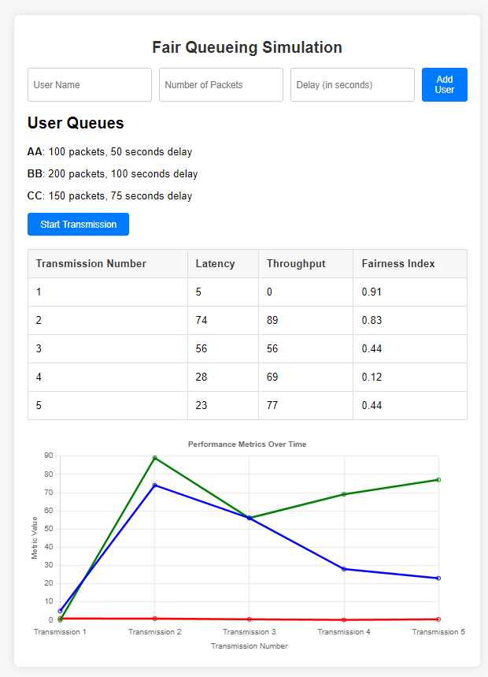

# Fair Queueing Algorithm

## Overview
This project implements a **Fair Queueing Algorithm** (FQA) to simulate packet transmission in computer networks. The goal is to allocate resources (such as bandwidth) to users in a way that ensures fairness in packet handling and transmission. It simulates a round-robin scheduling of packets while monitoring latency and throughput. The project is developed using **Node.js** and **React** to handle both the backend (algorithm logic and simulation) and the frontend (visualizing queues, delays, and transmission results).

## Features
- **Fair Queueing**: Implements the fair queueing algorithm using round-robin scheduling to handle packet transmission.
- **Queue Simulation**: Allows users to define multiple queues and simulate packet transmission with varying packet sizes and transmission delays.
- **Latency and Throughput Analysis**: Visualizes latency and throughput during packet transmission.
- **Data Visualization**: Displays results using charts and tables to analyze the performance of the network.
- **User Input Form**: A form where users can input packet data, delays, and transmission parameters.

## Technologies Used
- **Node.js**: Backend logic for simulating the fair queueing algorithm and packet transmission.
- **React**: Frontend interface to display the simulation results and handle user input.
- **Express.js**: Server-side framework for handling API requests.
- **Bootstrap**: Used for responsive design in the frontend.

## Setup

### Prerequisites
- **Node.js**: Ensure that Node.js is installed. You can download it from [here](https://nodejs.org/).
- **npm**: Node's package manager should be installed along with Node.js.

### Installation

1. Clone the repository to your local machine:
   ```bash
   git clone https://github.com/krish542/fair_queueing_algorithm.git
  
2. Navigate to the project directory:

  ```bash
  cd fair_queueing_algorithm
  ```
3. Install the dependencies for both the frontend and backend:
For the backend (Node.js):
  ```bash
  cd backend
  npm install
  ```
For the frontend (React):
  ```bash
  cd ../frontend
  npm install
  ```
4. Running the Project
Start the backend: Navigate to the backend directory and run:
  ```bash
  npm start
  ```
Start the frontend: In a separate terminal, navigate to the frontend directory and run:
  ```bash
  npm start
  ```
Open your browser and visit http://localhost:3000 to see the simulation interface.

## Usage
- Input the number of users, their packet sizes, transmission delays, and other parameters in the form.
- Press Start Simulation to simulate the packet transmission.
- The queues, delays, latency, throughput, and other relevant metrics will be displayed in real-time.
- View the results in graphical form (charts) for performance analysis.
## Screenshot
###Sample Example


### Example
An example of input parameters might look like:

- Number of users: 3
- Packet sizes: 100, 200, 150 bytes
- Transmission delays: 50ms, 100ms, 75ms
- 
After the simulation starts, the algorithm will process the packets in a round-robin manner, and the frontend will display the results.

###Contributing
Contributions are welcome! Feel free to open an issue or submit a pull request with improvements, bug fixes, or new features.

## Contact
For any inquiries, feel free to contact me at krish542@github.com.

This markdown file can be saved as `README.md` in your project repository. 
